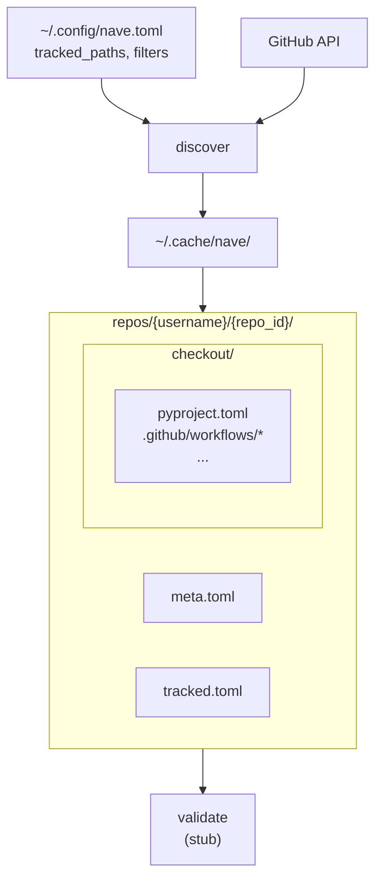

# nave

<!-- [](https://pepy.tech/project/nave) -->
[](https://github.com/astral-sh/uv)
[](https://pypi.org/project/nave)
[](https://pypi.org/project/nave)
[](https://pypi.python.org/pypi/nave)
[](https://results.pre-commit.ci/latest/github/lmmx/nave/master)

Fleet-level modelling and operations for OSS package repos.

<div align="center">
  
</div>

Rust core (`nave-rs`), Python entry point (`nave`).

## Motivation

See the blog series: [Fleet Ops](https://cog.spin.systems/fleet-ops).

Most OSS package development happens across dozens of small repos, each with its own
`pyproject.toml`, CI workflows, dependabot config, and pre-commit hooks. Managing them
as a fleet — enforcing consistency, rolling out changes, spotting drift — often
means ad-hoc shell loops over the GitHub API. `nave` is my attempt at a control
plane for these release process artifacts.

The goal is to model these configs declaratively, so as to facilitate query and bulk-edit
operations across repos. To achieve that, `nave` first validates that what's on disk matches
what you've specified (WIP!).

## Status

So far the following is implemented:

- **`nave init`** bootstrap step on the first-run, writes `~/.config/nave.toml`
- **`nave discover`** enumerates a user's public repos, walks their file trees, caches
  metadata for any file matching `tracked_paths` (globs supported)
- **`nave fetch`** sparse-checkouts discovered repos into `~/.cache/nave/`, pulling
  only the tracked files
- **`nave validate`** (TODO) will validate tracked configs against the (not-yet-written)
  fleet model

## Pipeline

- Running the `init` entrypoint sets up the user-level config
- Running the `discover` entrypoint uses that config (or writes it if called first)
  to enumerate all the GitHub repos for the user, and recording the default branch,
  a SHA for the repo tree, and when it was last pushed to. For each of the files in the repo tree,
  it records the SHAs of each file in the tracked file set
- Running the `fetch` entrypoint pulls down those files that were marked as tracked via
  a sparse clone (i.e. just those specific files) into a shallow clone of the repo (i.e. just the
  most recent version, not its full history)




## Try it

```bash
# Bootstrap config
nave init --no-interaction
cat ~/.config/nave.toml
#   Commented header explaining tracked_paths globs, then the
#   [github], [cache], [discovery] sections.

# Discover repos + tracked files
nave discover
#   Example summary: repos=240 with_tracked=138 tracked_files=377 auth=gh
ls ~/.cache/nave/repos/<username>/

# Re-run incrementally — only repos pushed since last run get re-checked
nave discover
#   incremental=true

# Prune repos no longer matching filters (forks, archived, narrowed tracked_paths)
# Note: only effective on a full (non-incremental) run.
rm ~/.cache/nave/meta.toml   # force full listing
nave discover --prune

# Fetch the tracked files themselves via sparse checkout
nave fetch
ls ~/.cache/nave/repos/<username>/<reponame>/checkout/

# Verbose logging
NAVE_LOG=debug nave fetch
```

### Template anti-unification

After acquiring your repo data, the fun part is modelling it.
To get the simplest possible description, we use anti-unification.

```bash
nave distil
```

It's easiest to show how that works with a relatively trivial format like Dependabot:

```bash
nave distil --filter dependabot
```

```yaml
━━ .github/dependabot.yml ━━
  instances: 9

  template:
    updates:
      - cooldown?: ⟨?0⟩
        directory: "/"
        package-ecosystem: ⟨?1⟩
        schedule:
          interval: ⟨?2⟩
    version: 2

  holes:
    updates[0].cooldown  [optionalkey]  3/9 optional  [constant when present]
        3× {"default-days":7}
    updates[0].package-ecosystem  [string]  9/9
        8× "github-actions"
        1× "cargo"
    updates[0].schedule.interval  [string]  9/9
        6× "weekly"
        3× "monthly"
```

Note you can also access this as JSON:

```
nave distil --json | jq '.groups[] | select(.pattern | contains("dependabot"))'
```

## Configuration

All settings live in `~/.config/nave.toml`. The defaults are deliberately visible at
the top of that file (written by `nave init`). The main one to customise:

```toml
[discovery]
tracked_paths = [
    "pyproject.toml",
    "Cargo.toml",
    ".pre-commit-config.yaml",
    ".pre-commit-config.yml",
    ".github/workflows/*.yml",
    ".github/workflows/*.yaml",
    ".github/dependabot.yml",
    ".github/dependabot.yaml",
]
case_insensitive = true
exclude_forks = true
```

Glob semantics are gitignore-ish: `*` doesn't cross `/`, `**` does, `?` and `[abc]`
work as expected.

Any field in `nave.toml` can be overridden via env var: `NAVE_GITHUB__USERNAME=foo`,
`NAVE_DISCOVERY__EXCLUDE_FORKS=false`, etc. (Double underscore is the section separator;
single underscores are part of field names.)

## Privacy / scope

`nave discover` queries `GET /users/{username}/repos`, which returns only **public**
repos even when authenticated as that user. Private repos are not included. Forks
and archived repos are filtered out by default; both are configurable.

The primary purpose of this software is for use with open source software,
private repo is a non-goal but feel free to fork for your own use cases.

## Auth

Auth is detected in this order:

1. `NAVE_GITHUB_TOKEN` environment variable
2. `gh auth token` (requires the `gh` CLI to be installed and authenticated)
3. Anonymous (60 requests/hour — note this will hit rate limits on first discovery of large
   accounts)

## Architecture

This repo is a Rust workspace of focused crates:

- `nave`: the binary (subcommand routing, logging)
- `nave_config`: layered config providers via [figment2](https://crates.io/crates/figment2),
  cache layout, path matching
- `nave_github`: GitHub REST client with auth probing
- `nave_discover`: orchestrates repo listing, tree walking, and cache updates
- `nave_fetch`: sparse-checkout fetcher

The Python entry point is a thin `maturin`-packaged shim (`python/nave/`) that finds and
execs the Rust binary (the same pattern used by the likes of `uv` and `ruff`).

## Development

To install git hooks with [cargo husky][husky], run `cargo test`

```bash
just build     # workspace build
just test      # cargo nextest
just lint      # clippy + ruff
just pre-commit   # what the pre-commit hook runs
just pre-push # what the pre-push hook runs
```

[husky]: https://github.com/rhysd/cargo-husky
