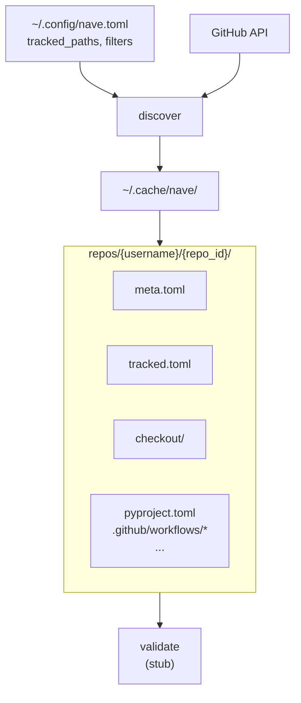

# nave

Fleet-level modelling and operations for OSS package repos.

<div align="center">
  
</div>

Rust core (`nave-rs`), Python entry point (`nave`).

## Motivation

See the blog series: [Fleet Ops](https://cog.spin.systems/fleet-ops).

Most OSS package development happens across dozens of small repos, each with its own
`pyproject.toml`, CI workflows, dependabot config, and pre-commit hooks. Managing them
as a fleet — enforcing consistency, rolling out changes, spotting drift — currently
means ad-hoc shell loops over the GitHub API. `nave` is an attempt at a proper control
plane: model the configs declaratively, query and bulk-edit across repos, validate that
what's on disk matches what you've specified.

## Status

Early-stage, pre-alpha. Currently implemented:

- **`nave init`** — first-run bootstrap; writes `~/.config/nave.toml`
- **`nave discover`** — lists a user's public repos, walks their file trees, caches
  metadata for any file matching `tracked_paths` (globs supported)
- **`nave fetch`** — sparse-checkouts discovered repos into `~/.cache/nave/`, pulling
  only the tracked files
- **`nave validate`** — stub; will validate tracked configs against the (not-yet-written)
  fleet model

## Pipeline



## Try it

```bash
# Bootstrap config
cargo run --bin nave -- init --no-interaction
cat ~/.config/nave.toml
#   Commented header explaining tracked_paths globs, then the
#   [github], [cache], [discovery] sections.

# Discover repos + tracked files
cargo run --bin nave -- discover
#   Example summary: repos=240 with_tracked=138 tracked_files=377 auth=gh
ls ~/.cache/nave/repos/<username>/

# Re-run incrementally — only repos pushed since last run get re-checked
cargo run --bin nave -- discover
#   incremental=true

# Prune repos no longer matching filters (forks, archived, narrowed tracked_paths)
# Note: only effective on a full (non-incremental) run.
rm ~/.cache/nave/meta.toml   # force full listing
cargo run --bin nave -- discover --prune

# Fetch the tracked files themselves via sparse checkout
cargo run --bin nave -- fetch
ls ~/.cache/nave/repos/<username>/<reponame>/checkout/

# Verbose logging
NAVE_LOG=debug cargo run --bin nave -- fetch
```

## Configuration

All settings live in `~/.config/nave.toml`. The defaults are deliberately visible at
the top of that file (written by `nave init`). The main one to customise:

```toml
[discovery]
tracked_paths = [
    "pyproject.toml",
    "Cargo.toml",
    ".pre-commit-config.yaml",
    ".pre-commit-config.yml",
    ".github/workflows/*.yml",
    ".github/workflows/*.yaml",
    ".github/dependabot.yml",
    ".github/dependabot.yaml",
]
case_insensitive = true
exclude_forks = true
```

Glob semantics are gitignore-ish: `*` doesn't cross `/`, `**` does, `?` and `[abc]`
work as expected.

Any field in `nave.toml` can be overridden via env var: `NAVE_GITHUB__USERNAME=foo`,
`NAVE_DISCOVERY__EXCLUDE_FORKS=false`, etc. (Double underscore is the section separator;
single underscores are part of field names.)

## Privacy / scope

`nave discover` queries `GET /users/{username}/repos`, which returns only **public**
repos even when authenticated as that user. Private repos are not included. Forks
and archived repos are filtered out by default; both are configurable.

## Auth

Auth is detected in this order:

1. `NAVE_GITHUB_TOKEN` environment variable
2. `gh auth token` (requires the `gh` CLI to be installed and authenticated)
3. Anonymous (60 requests/hour — will hit rate limits on first discovery of large
   accounts)

## Architecture

Workspace of focused crates:

- `nave` — the binary (subcommand routing, logging)
- `nave_core` — shared primitives (currently minimal)
- `nave_config` — layered config via [figment2](https://crates.io/crates/figment2),
  cache layout, path matching
- `nave_github` — GitHub REST client with auth probing
- `nave_discover` — orchestrates repo listing, tree walking, and cache updates
- `nave_fetch` — sparse-checkout fetcher

Python entry point is a thin `maturin`-packaged shim (`python/nave/`) that finds and
execs the Rust binary — same pattern as `uv`, `ruff`, `ty`.

## Development

```bash
just build     # workspace build
just test      # cargo nextest
just lint      # clippy + ruff
just pre-commit   # what the hook runs
```
